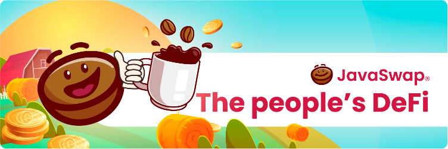
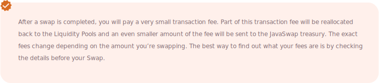

# ☕ JavaSwap Intro

JavaSwap is a cutting edge AMM and yield farm on Polygon \(MATIC\) with the fastest transaction speeds, the cheapest fees and the most intuitive user interface. JavaSwap is the people’s token, allowing anyone to rapidly swap without paying overly expensive fees. Here are some of its most unbeatable features:

 Ultra rapid transaction times 

 Ultra low transaction fees

 Faster and cheaper than both Uniswap and PancakeSwap 

 Simple user interface for smooth user experience 

 ERC-20 compatible

 High yield farming on Java Farm 

 Professionally audited smart contracts 

 Rigorous security mechanisms ensuring community confidence

Our mission is to onboard a new generation of DeFi users with our vast array of innovative DeFi services including, but not limited to: swap, staking, farming, pools and games, which operate as a burning mechanism and much, much more. JavaSwap combines minimum user effort with maximum operational efficiency, streamlining AMM trading and onboarding a new generation of DeFi users.

Due to JavaSwap being part of the MATIC network, JavaSwap has the lowest transaction costs out of all the AMM’s, being much cheaper than both Ethereum based AMM’s such as Uniswap and even Binance Smart Chain based AMM’s such as PancakeSwap. We are the future of DeFi, and the future of DeFi is us! No other DEX or AMM can compete with our suite of services and our formation of future-proofed, formidable features. Buy now whilst the coffees are hot!

##   Earn tokens with Espresso Pools 

JAVA is a token for the people, brought by the people and hodled amongst the people! Stake JAVA and earn tokens. Java holders can earn profits each week just by holding JAVA. Here at JavaSwap, we’re creating a diverse ecosystem with new projects in order to interchange tokens and create profitable opportunities. Build our DeFi community by providing liquidity.

##   Earn JAVA with Java Farms

Stake LP tokens and earn JAVA! Although market fluctuations affect the farms more, this risk is balanced by even higher returns. To earn JAVA just add liquidity to our exchange!

##    Earn transaction fees

Even if a pair doesn’t exist yet on Java Farms, you can still earn trading fees after you stake your tokens to our LPs.

##   AMM

An Automatic Market Maker \(AMM\) is a type of decentralized exchange that is permissionless and automated. It provides liquidity through automated algorithmic trading as opposed to the traditional centralized exchanges which use an order book system. Users supply Liquidity Pools with tokens which are then governed by a mathematical formula which algorithmically computes the asset's price.

##  JavaSwap

Swapping and trading tokens on JavaSwap.io is super simple. Once your wallet is connected, you can swap any compatible tokens using JavaSwap. After checking the details of the transaction, including checking your fees, you can then click confirm and finally complete the transaction.

JavaSwap is an AMM that allows you to swap cryptocurrencies using Polygon \(Matic Network\). JavaSwap allows you to provide liquidity to LPs which will then earn you a lot of Java! You can also collect fees on a portion of the transaction fees of liquidity providers, earning even more!

##   DEX Features

Swapping and trading tokens on JavaSwap.io is super simple. Once your wallet is connected, you can swap any compatible tokens using JavaSwap. After checking the details of the transaction, including checking your fees, you can then click confirm and finally complete the transaction.

JavaSwap is an AMM that allows you to swap cryptocurrencies using Polygon \(Matic Network\).

##   Espresso Pools

The Liquidity Pools \(LPs\) on JavaSwap are known as Espresso pools, our Espresso pools function the exact same way as traditional pools on Uniswap and PancakeSwap. So anyone can provide liquidity via their tokens and earn JAVA. Any JavaSwap user can place their tokens in any pool we have available.

Choose your pool, stake your tokens, then sit back and watch your JAVA accumulate! Espresso pools allow you to stake your tokens in open pools and earn massive returns via the JAVA token. The process is simple and instant, place your tokens in the corresponding pool and then you'll instantly start earning JAVA yield based on the total amount staked.

 

 

##  Java Farm

Hello JAVA farmers, it’s time to harvest some liquidity for a nice JAVA yield! In order to farm JAVA you need to provide liquidity to one of the available tokens in the Espresso pool which you can find on the farm page. JavaSwap users will need to allocate their 2 tokens in different farms in proportional amounts.

After providing liquidity and receiving your JAVA LP tokens, please select the pool from the farm page, approve the contract and click the plus sign, choosing the amount you want to stake and then confirm approval.

 

##   Games

We offer the best games for you to take advantage and use our token in the most fun way possible. Don't settle for one if you can try the 3 games that javaswap developed for you.

Learn more about:

   

