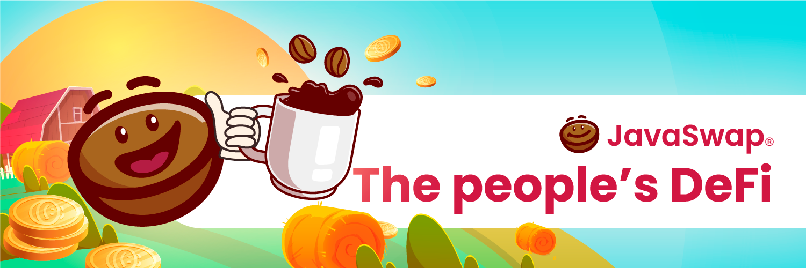

# JavaSwap Intro

JavaSwap is a cutting edge AMM and yield farm on Polygon \(MATIC\) with the fastest transaction speeds, the cheapest fees and the most intuitive user interface. JavaSwap is the people’s token, allowing anyone to rapidly swap without paying overly expensive fees. Here are some of its most unbeatable features:

                             - items1

                             - items1

                             - items1

                             - items1

                             - items1

                             - items1

Our mission is to onboard a new generation of DeFi users with our vast array of innovative DeFi services including, but not limited to: swap, staking, farming, pools and games, which operate as a burning mechanism and much, much more. JavaSwap combines minimum user effort with maximum operational efficiency, streamlining AMM trading and onboarding a new generation of DeFi users.

  

