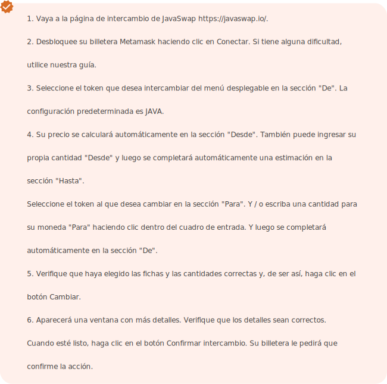

# JavaSwap

JavaSwap está diseñado para facilitar transacciones rápidas fuera de la cadena, haciéndolas rápidas y rentables para los intercambios de tokens basados ​​en blockchain.

### ¿Cómo intercambiar en JavaSwap?

El intercambio de tokens en JavaSwap es similar al intercambio en Uniswap o PancakeSwap; la única diferencia es que aquí es más fácil, debido a nuestra sencilla interfaz de usuario. A diferencia de los CEX, no hay libros de pedidos complicados y confusos que lo abrumen.

### Requisitos previos comerciales.

Antes de ejecutar cualquier intercambio, necesita una billetera Metamask, como se indicó anteriormente.   

 

