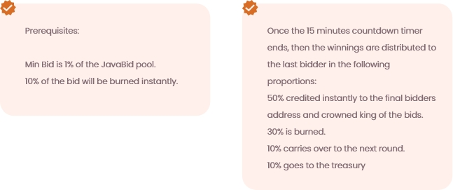

# JavaBid

Now I’m guessing you’re a very curious person and are wondering what Javabid is? Well, JavaBid is where the biggest bidders battle for an abundantly bulky bounty! Every 15 minutes a countdown timer resets and the next bid begins. Every bid must be higher than the last bid, and the last person standing with the final bid takes the whole jackpot of cumulatively bidded wealth!

JavaBid is where the biggest bidders battle for an abundantly bulky bounty! Every 15 minutes a countdown timer resets and the next bid begins. Every bid must be higher than the last bid, and the last person standing with the final bid takes the whole jackpot of cumulatively bidded wealth!

### How do I play JavaBid?

JavaBid is where the biggest bidders battle for an abundantly bulky bounty! Every 15 minutes a countdown timer resets and the next bid begins. Every bid must be higher than the last bid, and the last person standing with the final bid takes the whole jackpot of cumulatively bidded wealth!

Playing JavaBid is super simple; you just need to be the last bidder to win the whole jackpot!

