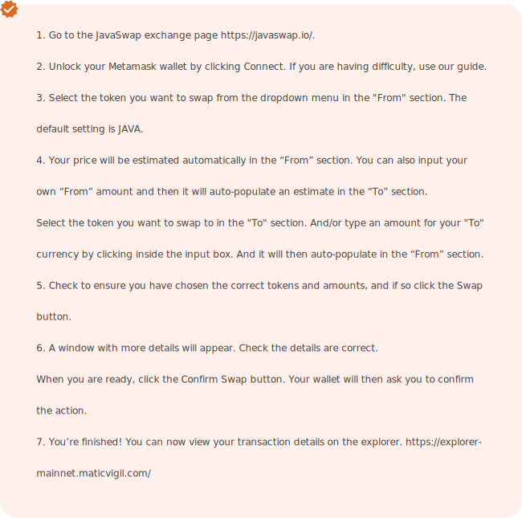

# JavaSwap

JavaSwap is designed to facilitate rapid off-chain transactions, making them fast and cost-effective for blockchain based token swaps

### How to swap on JavaSwap

Swapping tokens on JavaSwap is similar to swapping on Uniswap or PancakeSwap; the only difference is that it's easier here, due to our simple user interface. Unlike CEXs there are no complicated and confusing order books to overwhelm you.

### Trading prerequisites

Before executing any swaps, you need a Metamask wallet, as stated previously

