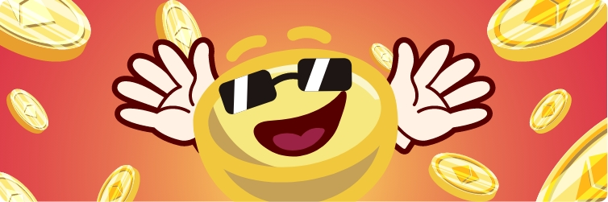

# JavaBid

Ahora supongo que eres una persona muy curiosa y te preguntas qué es JavaBid. Pues bien, JavaBid es el lugar donde los mayores jugadores luchan por una gran recompensa. Cada 15 minutos se reinicia un temporizador de conteo regresivo y comienza la siguiente oferta. Cada oferta debe ser más alta que la última, y la última persona en pie con la oferta final se lleva todo el bote de la riqueza acumulada.

¿Cómo jugar JavaBid?

JavaBid es donde los mejores postores luchan por una recompensa enormemente abultada! Cada 15 minutos se reinicia un temporizador de cuenta regresiva y comienza la siguiente oferta. Cada puja debe ser más alta que la última puja, y la última persona en pie con la puja final se lleva todo el premio mayor de la riqueza pujada acumulativamente. 

Jugar JavaBid es super simple; ¡solo necesita ser el último postor para ganar todo el premio mayor!

  

