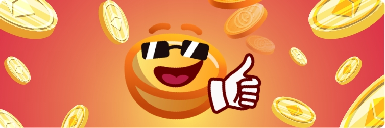

# JavaFlip

JavaFlip es un juego en el JavaSwap AMM que te permite divertirte mientras lanzas monedas. Lanza una moneda y gana JAVA si ganas tu apuesta. Si ganas, ¡obtendrás el doble de tu apuesta inicial! ¡Lanza una moneda para ganar! \(Próximamente\).  

### Cómo jugar JavaFlip?

Jugar JavaFlip es más sencillo que lanzar una moneda real. Todo lo que tiene que hacer es hacer clic en el botón "voltear" después de elegir la cantidad inicial para apostar. Si gana, será recompensado con su JAVA.

### **Dónde encontrar las analíticas**

Aquí están nuestras analíticas: \(coloque el hipervínculo al sitio de análisis\)

### **¿Por qué las tarifas son tan bajas?**

Esa es una buena pregunta. Las tarifas son tan bajas porque JavaSwap utiliza la red Polygon, que es una solución de red de capa 2 diseñada para aportar escalabilidad masiva a Ethereum e interoperabilidad entre otras blockchains. Dado que la transacción se realiza en la red MATIC, las tarifas son de aproximadamente 0,00003 USD.  
  
****Esa es una buena pregunta. Las tarifas son tan bajas porque JavaSwap utiliza la red Polygon, que es una solución de red de capa 2 diseñada para aportar escalabilidad masiva a Ethereum e interoperabilidad entre otras blockchains. Dado que la transacción se realiza en la red MATIC, las tarifas son de aproximadamente 0,00003 USD.

Polygon, que antes se llamaba MATIC, resuelve por fin el problema de Ethereum con sus altas tarifas de gas y sus altos tiempos de confirmación para activos como USDT, USDC o DAI y otros tokens ERC20. Por lo tanto, JavaSwap aprovecha la eficiencia y la velocidad de los precios de la red de Polygon para crear una AMM verdaderamente descentralizada, con igualdad de condiciones para todos los usuarios, tanto nuevos como experimentados. Una ventaja relacionada a esto es que los usuarios más pequeños de DeFi ahora pueden finalmente intercambiar pequeñas cantidades de activos sin que se les cobren costosas comisiones que a menudo cuestan más que los tokens que están tratando de obtener. Como todos los grandes productos impulsados por la gente, JavaSwap está diseñado de manera que sea justo, transparente y equitativo, para que nuestra comunidad tenga la misma oportunidad de beneficiarse y cosechar los rendimientos de JAVA.  

