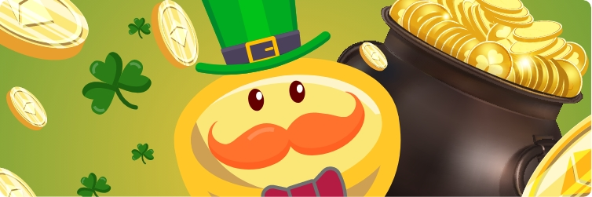

# Lucky Lotto

Lucky Lotto es un juego similar a la lotería de PancakeSwap.

Un boleto de Lucky Lotto cuesta 1 JAVA. ****No hay límite de boletos, sin embargo sólo se pueden comprar 50 boletos a la vez a través de nuestra plataforma de usuario. Después de comprar un boleto, se generará un código numérico aleatorio de 4 dígitos, que estará comprendido entre el 1 y el 14. Por ejemplo: "2-9-7-6".

Cuando ganas el bote de la lotería de la suerte, ¡recibes el 50% de todo el fondo de la lotería! Para ganar necesitas que los 4 números generados aleatoriamente en tu boleto coincidan con la secuencia exacta de los 4 números ganadores.

Sin embargo, aunque no ganes el bote, ¡puedes ganar un montón de JAVA! Como mínimo, si acierta 2 o más números en la secuencia correcta recibirá una recompensa. Aquí están todas las formas posibles de ganar JAVA: 

 Si aciertas los 4 números en el orden exacto = ganas el 50% del bote \(o dividir el bote si hay más de un ganador\).

 Si aciertas 3 números en el orden exacto = ganar o repartir el 20% del bote.

 Si aciertas 2 números en el orden exacto = gana o se reparte el 10% del bote.

 El 20% restante del bote será quemado.

Si no hay ganadores que acierten 3 números durante la duración del sorteo de la Lucky Lotto, entonces se quemará el 20% asignado a los ganadores.

Una vez sorteados los números ganadores de la Lucky Lotto, estos aparecerán en la página. Los usuarios con más de 2 números en la secuencia correcta pueden reclamar sus ganancias y comprobar las estadísticas para ver cuántos otros números han acertado. Los números ganadores de la lotería de la suerte son generados completamente al azar y por lo tanto nadie puede predecir los números ganadores ni hacer trampa.   
  
  
****

